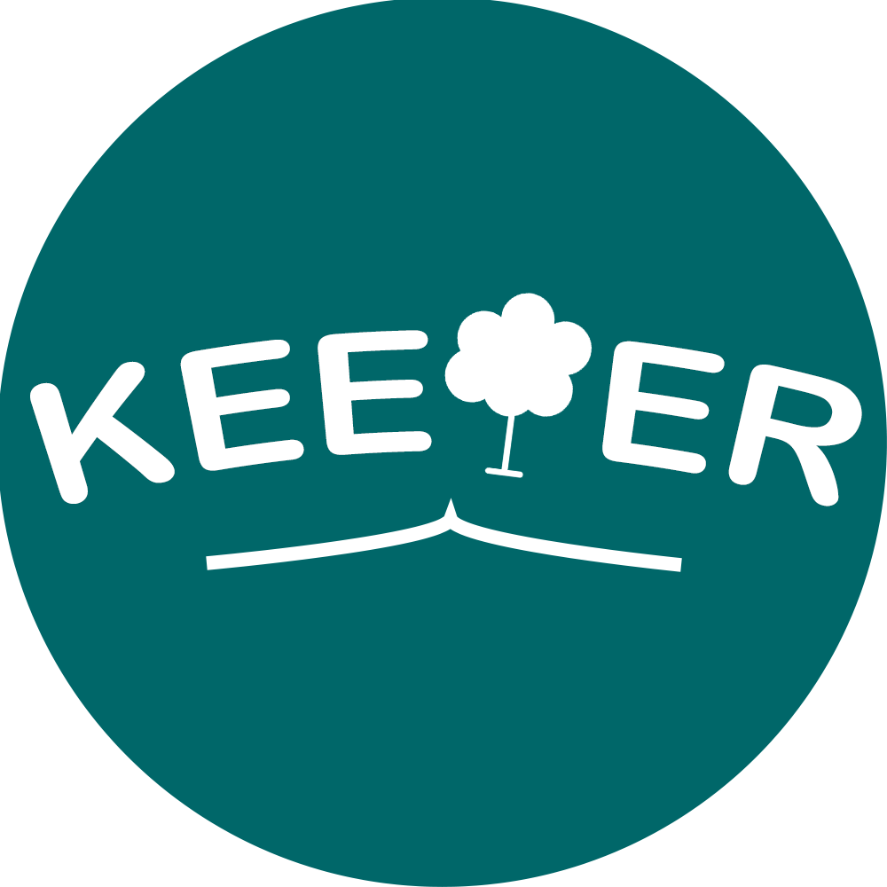

  

<h1 style="text-align: center;"><b>Keeper</b></h>
<h2 style="text-align: center;"><b>"Keep everything better together"</b></h>

## ***powered by***

  
  
  
  
  
  
  

---

# **Keeper**
## **Members**
### **Mobile team**
|**Name**|**Name**|**Name**|
|:---:|:---: | :---:|
|[Trần Đình Nhật Trí](https://github.com/cheesepp)|<empty>|[Nguyễn Phước Anh Tuấn](https://github.com/purified-water)|
### **AI services/backend team teamsss (repesentitive)**
|**Name**|
|:---:|
|[Trần Hoàng Bảo Ly](https://github.com/UIT-21521109) (designer part time)|
### **six-star mascot/backend-team**
|**Name**|
|:---:|
|[Lê Thanh Minh](https://github.com/Kryst4lize)|

---
## **User guide**
### **Content**
|**name**|**description**|
|:---:|:---: | 
|[mobile app](./app/)|Folder contain mobile app, follow it's readme|
|[app services](./services/)|Folder contain app services, follow it's readme|
|[ai services](./ai-services/)|Folder contain ai services, follow it's readme|

## Thank you for your time and consideration!!!
